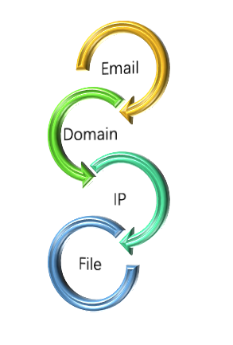

# IOC Explorer - Explore IOCs Automatically



## Introduction

Correlating Indicator of Compromise (IOC) is a key part of incident investigation even threat hunting. Finding one IP address hosting several known malicious files would help SOC teams to implement more effective countermeasure by blocking that IP address. However, building a correlation usually means a lot of manual work, like searching multiple IOCs across different threat intelligence sources (community sources or private sources). Sometimes, correlation can only be found after several iterative queries. 

IOC Explorer aims to execute iterative queries across multiple threat intelligence sources automatically. It may assist security analyst to find more clues for investigation.

## Requirements

IOC Explorer is written in Python 3. It is *not* tested in other Python versions. 

Please make sure you have installed following libraries prior to start:

1. requests  2.20.1
2. anytree 2.4.3

## Quick Start

1. Open config.ini file, and type in your API Key of VirusTotal or QiAnXin_TI section
2. Open ioc.csv file, and type in your query IOC (eg., 'domain, xnz.freetzi.com')
3. Run the tool in command line
```
$python explorer.py
```
4. Go to './results' directory to check your query result

## Usage in Details

### Initial Configuration

There are some settings to configure before first run. Basiclly, all settings stored in 'config.ini' file can be splitted into two categories: query behavior setting and threat intelligence setting.

'depth' setting in 'general' section is an important query behavior setting. It defines the times of iterative queries, which will query intelligence sources based on IOCs returned on previous queries. Default setting is 'depth=3'. If user increases the value, the tool carries additional queries on previous returned IOCs. 

Each threat intelligence has its own but different settings. However, API key is the most common setting for intelligence sources, which is also required.

### Input IOC

Currently, 4 IOC types are supported, namely as followings,

- email address (ioc_type='email')
- file hash (ioc_type='file') Note: md5/sha1/sha256 are supported
- ip address (ioc_type='ip_address')
- domain name (ioc_type='domain')

CSV file (by default, ./ioc.csv) is the place to input IOC for query. The CSV file has following format for data,

```
IOC_type, IOC_value
```

For example,

```
domain, xnz.freetzi.com
file, c0531f812a1ec5e825f7250f7b52db7621ecf93d973f0e3ba1aa0372e0f559f2
email, 373192510@qq.com
ip_address, 192.99.142.235
```

### Output Result

After querying multiple threat intelligence sources, IOC Explorer will collect all returned IOCs and output them in a well-organized way.

This tool supports two output formats: plain-text and JSON.

IOCs in plain-text is organized in tree style, like followings:

```
AnyNode(id='373192510@qq.com', type='email')
├── AnyNode(id='qq758.com', relation='QAX: Whois email to domain', type='domain')
│   ├── AnyNode(id='5292086@qq.com', relation='QAX: domain to whois email', type='email')
│   │   ├── AnyNode(id='ltcp3.com', relation='QAX: Whois email to domain', type='domain')
│   │   ├── AnyNode(id='lzskqc.com', relation='QAX: Whois email to domain', type='domain')
│   │   ├── AnyNode(id='df796.com', relation='QAX: Whois email to domain', type='domain')
│   │   ├── AnyNode(id='mir900.com', relation='QAX: Whois email to domain', type='domain')
│   │   ├── AnyNode(id='888hl.com', relation='QAX: Whois email to domain', type='domain')
│   │   ├── AnyNode(id='jiemianpaomo.com', relation='QAX: Whois email to domain', type='domain')
│   │   ├── AnyNode(id='qx969.com', relation='QAX: Whois email to domain', type='domain')
│   │   ├── AnyNode(id='c888c.com', relation='QAX: Whois email to domain', type='domain')
│   │   ├── AnyNode(id='982307.com', relation='QAX: Whois email to domain', type='domain')
│   │   └── AnyNode(id='ac0028.com', relation='QAX: Whois email to domain', type='domain')
│   ├── AnyNode(id='47.91.202.66', relation='VT: domain to resolution ip', type='ip_address')
│   │   ├── AnyNode(id='4bf7e7e6c78c1a69def4beef216ad52dbabae1f831f49067e3b29f8a7a62d71e', relation='VT: IP to downloaded file', type='file')
│   │   ├── AnyNode(id='e682dfcdde010f6e15bae0d843696f6ae8d5a85e75441660b782789ee747f075', relation='VT: IP to downloaded file', type='file')
│   │   ├── AnyNode(id='88f089e2e069ca698fa498fb5ba5f46fd95d3c8ee5b4c5c6587eae8d2db43fe7', relation='VT: IP to downloaded file', type='file')
│   │   ├── AnyNode(id='39a75a83af8d38202ab05de7ac9beae6e00d21501867601cc2a86094c79d6f16', relation='VT: IP to downloaded file', type='file')
│   │   ├── AnyNode(id='1630ab0121c4df64230045ef86ee54e5ee05bd371c2b3c26bcdb0ef3a0d2360f', relation='VT: IP to downloaded file', type='file')
│   │   ├── AnyNode(id='7d04f7431bbfa41a04bcc7e6b98b9de0d919756c4c671c5785c99fff45f16402', relation='VT: IP to downloaded file', type='file')
│   │   ├── AnyNode(id='9b342ae7f25d65bdb817d8c995f3211ac398e41575fc5d149d994c1dcb008f0a', relation='VT: IP to downloaded file', type='file')
│   │   ├── AnyNode(id='39d6bba9f294f11f84933e48483aff12a9efc5c7d6eb4f57a8d36ef8bd71823e', relation='VT: IP to downloaded file', type='file')
│   │   ├── AnyNode(id='d37608c9b93ae18c5ed5d376e32449f95358f708a35cd8b06431ca2be733f87e', relation='VT: IP to downloaded file', type='file')
│   │   └── AnyNode(id='fb7595b2d6f1cc89cca75ec06186c228274e95fb6c3e233e8de2e804284ab8c1', relation='VT: IP to downloaded file', type='file')
```

Default output directory is './results'. Filename follows this naming rule: {ioc_value}_depth_{depth_value}_{timestamp}, like '192.99.142.235_depth_3_201907171110.txt'

More sample results are given in './samples' directory for reference.

## Threat Intelligence Sources

A plenty of TI sources exist in cybersecurity field. As a start, IOC Explorer supports following sources:

- VirusTotal, both public and private data available
- QiAnXin, only private data

A summary of IOC relations is following,

| Source     | Type               | Relation        | Explanation                                     |
| ---------- | ------------------ | --------------- | ----------------------------------------------- |
| VirusTotal | Public and private | Ip -> file      | Files downloaded from the IP address            |
| VirusTotal | Public and private | Domain -> file  | Files downloaded from the domain                |
| VirusTotal | Public and private | Domain -> ip    | DNS resolutions for the domain                  |
| VirusTotal | Public and private | File -> ip      | IP addresses contacted by the file              |
| VirusTotal | Public and private | File -> domain  | Domains contacted by the file                   |
| VirusTotal | Public and private | File -> file    | Files that executed the file                    |
| QiAnXin    | Private            | Domain -> ip    | DNS resolutions (A record) for the domain       |
| QiAnXin    | Private            | Domain -> email | Registrant email for the domain in Whois record |
| QiAnXin    | Private            | Email -> domain | Domain names registered in the same email       |
| QiAnXin    | Private            | File -> ip      | IP addresses contacted by the file              |
| QiAnXin    | Private            | File -> domain  | Domains contacted by the file                   |

You can can contact me for public available sources. Or you add your private sources by yourself.

## Future Plan

During tests, some known good IOCs (like CDN ip addresses) are listed results. If there is a tag attached to the IOCs, that would bring additional hints for analysis. But such data enrichment requires more reliable data sources. Searching data sources is one (probably long-term) item of future plan.

Any ideas or suggestions are appreciated, and feel free to contact me: lion.gu@gmail.com